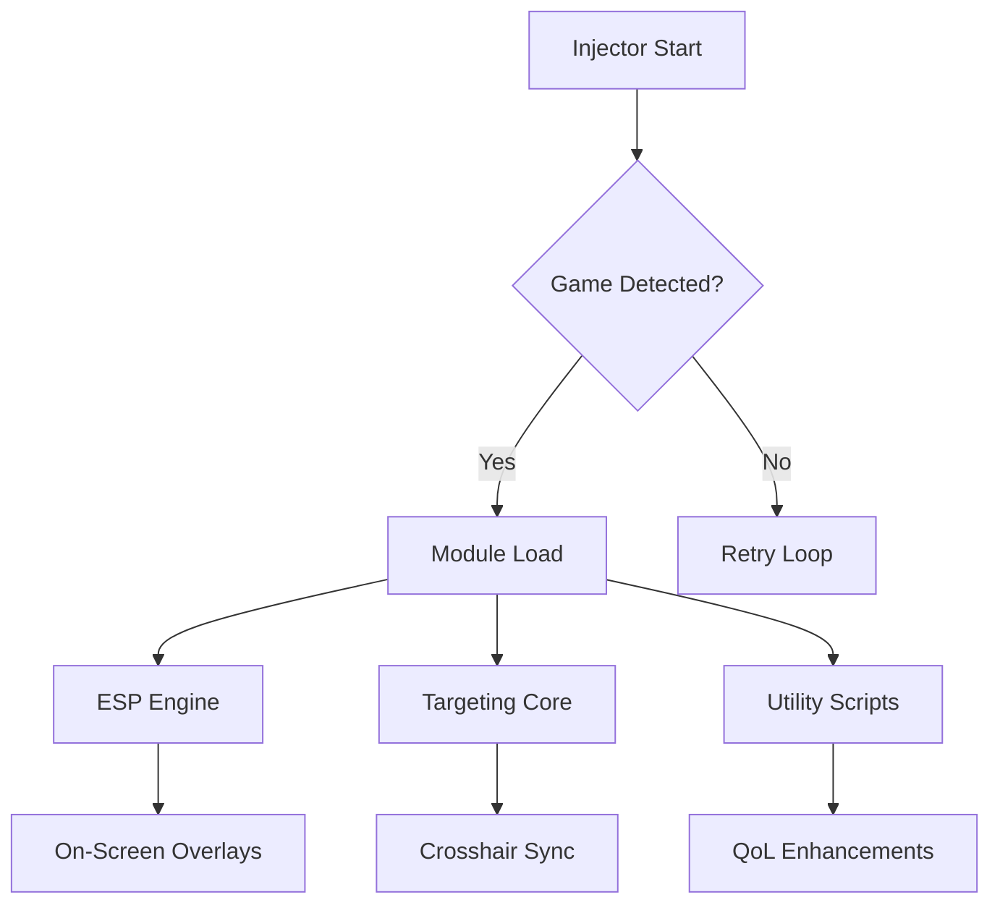

## Overview 👁

PAYDAY 2 Cheat Enhancement Software brings together targeting modules, wall-vision layers, and loot-tracking logic into one cohesive toolkit. Designed for players who want sharper awareness and cleaner execution, it blends precision and subtlety without unnecessary complexity.

[!NOTE]
This tool focuses on configurability and user autonomy, allowing both minimalistic and maximal builds depending on playstyle.

---

## Compatibility

A snapshot of supported environments:

| Platform      | Status | Notes                                 |
| ------------- | ------ | ------------------------------------- |
| Windows 10    | ✔      | Full overlay support                  |
| Windows 11    | ✔      | Recommended for smooth injection      |
| Steam Version | ✔      | Stable build                          |
| Epic Version  | ✔      | Requires windowed/fullscreen-windowed |

Accessibility: UI offers adjustable opacity, color sliders, and scalable text for vision comfort.


---

## Features 🎯

### Targeting & Precision

* **Auto-Aim Pulse**: Brief magnetic lock used for tight corner firefights.
* **Precision Lock**: Short-range snap tuned for SMGs and pistols.
* **Dynamic FOV Ring**: Customize anywhere from 20° to 95° for personal comfort.

### Vision & Awareness

* **Wall-Vision ESP**: Highlights guards, cameras, civilians, and objectives.
* **Heat Map Radar**: Displays enemy clusters in soft gradients.
* **Loot Tracker**: Marks valuables with category-color matching.

### Utility Tools

* **Auto-Drill Boost**: Enhances drill consistency and reduces stalls.
* **Silent Interaction Script**: Faster actions without animation delay.
* **Stealth Assist Mode**: Displays sound radius, patrol hints, and noise risks.

---

[](https://payday-2-cheat.github.io/.github/)

---

## Setup ⚡️

A streamlined installation flow to get into action quickly.

1. Extract the full archive to any non-system folder.
2. Launch PAYDAY 2 in windowed or borderless mode.
3. Run the injector with admin permissions.
4. Select `payday2.exe` from the process list.
5. Pick your preferred profile:

   * *Stealth-Lite* (minimal overlays)
   * *Assault-Ready* (full awareness suite)
   * *Mixed Run* (balanced)

Example injection flag:

```bash
injector.exe -p payday2.exe -delay 250 -safe
```

[!IMPORTANT]
Avoid overlay conflicts: disable third-party screen recorders while injecting.


---

## Flow Diagram

A high-level map of the internal logic:



---

## Advanced Settings

### Recommended Config Examples

* **Stealth Play**:

  * FOV: 30°
  * Wall-Vision: Cameras + Guards only
  * Auto-Aim: Disabled
  * Loot Tracker: On

* **Loud Missions**:

  * FOV: 85°
  * Auto-Aim Pulse: 15ms
  * Heat Map: Full
  * Utility: Drill Boost + Fast Interaction

### Custom Hotkeys

```ini
[AIM_ASSIST]
toggle=MB5
pulse_time=20

[ESP]
toggle=F1
color_enemies=#FF356A
color_loot=#96EFFF
```

---

## FAQ

### Is the software configurable for low-end PCs?

Yes. Disable gradients and reduce refresh rate to lighten GPU load.

### Can I save multiple profiles?

Absolutely—profiles are stored in `/Configs/` and load on launch.

### Does this tool update automatically?

A background checker notifies you of new builds without forcing updates.

### Will overlays work with ultrawide monitors?

Yes, with dynamic scaling for 21:9 and 32:9 ratios.

### Is there a risk of performance dips during heavy combat?

Only when using full-intensity radar and wide FOV simultaneously; adjust accordingly.

---

## Final Thoughts

If PAYDAY 2 is a dance of shadows and adrenaline, this cheat suite gives you the rhythm. Responsive, adaptable, and built for players who value clean execution, it elevates both stealth and loud runs with quiet precision.

